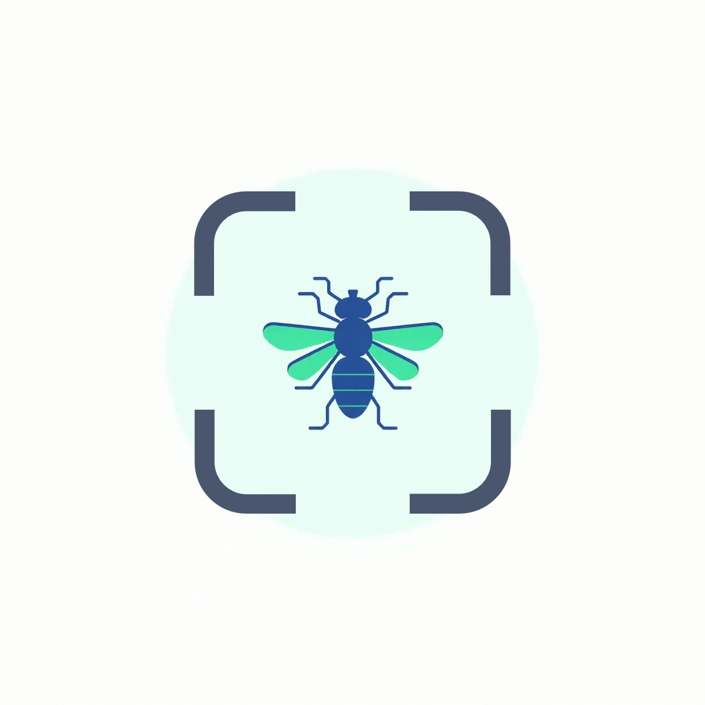

# 🦟 FlySpotter Pro

<p align="center">
  
</p>

<p align="center">
  <strong>Revolutionizing Fly Identification with Artificial Intelligence</strong>
</p>

## 📱 Project Overview

FlySpotter Pro is a cutting-edge mobile application designed to transform the way we identify and understand fly species. Leveraging the power of machine learning and cross-platform development, this app provides a seamless, intelligent solution for entomologists, researchers, pest control professionals, and nature enthusiasts.

## ✨ Key Features

### 🤖 Intelligent Identification
- **Advanced AI Recognition**: Utilize state-of-the-art TensorFlow Lite machine learning models to identify fly species with remarkable accuracy
- **Instant Results**: Get species identification within seconds of capturing or uploading an image
- **Continuous Learning**: Machine learning model improves with each identification

### 🌐 Cross-Platform Experience
- **Seamless Performance**: Native-like experience on both iOS and Android
- **Responsive Design**: Optimized UI for various screen sizes and devices
- **Offline Capability**: Full functionality without internet connection

### 🔒 User Management
- **Secure Authentication**: 
  - Email/password login
  - Google Sign-In integration
  - Secure Firebase authentication
- **Personalized Profiles**: Create and customize your user experience
- **Data Privacy**: Robust protection of user information

### 📊 Advanced Tracking & Discovery
- **Comprehensive Identification History**: 
  - Track and review all your previous fly identifications
  - Export and analyze your discovery data
- **Interactive Geographical Mapping**:
  - Visualize fly species locations on an integrated Google Maps interface
  - Contribute to citizen science by logging fly sightings

### 📚 Educational Content
- **Detailed Species Guide**: 
  - In-depth information about various fly species
  - Scientific descriptions, habitat information, and interesting facts
- **Gamification Elements**:
  - Achievements and rewards system
  - Encourage continuous learning and exploration

### 🌈 User Experience
- **Dark Mode**: Comfortable viewing in any lighting condition
- **Multilingual Support**: Accessible to a global audience
- **Social Sharing**: Share discoveries with the community
- **Cloud Synchronization**: Seamless data sync across multiple devices

## 🛠️ Technical Architecture

### Frontend
- **Flutter**: Cross-platform UI framework
- **GetX**: Efficient state management and dependency injection
- **Responsive Widgets**: Adaptive design principles

### Backend & Services
- **Firebase**:
  - Authentication
  - Firestore real-time database
  - Cloud Storage for images
- **TensorFlow Lite**: On-device machine learning inference
- **Google Maps API**: Location services and mapping

### Machine Learning
- **Model**: Custom-trained fly species classifier
- **Framework**: TensorFlow Lite
- **Training Data**: Comprehensive fly species dataset
- **Inference**: Fast, efficient on-device predictions

## 📋 System Requirements

### Development Environment
- **Flutter**: v3.0.0+
- **Dart**: v2.17.0+
- **IDEs**: 
  - Android Studio
  - Visual Studio Code
  - XCode (for iOS development)

### Supported Platforms
- **Android**: SDK 21+
- **iOS**: Version 11+
- **Minimum Device Requirements**: 
  - 2GB RAM
  - 64-bit processor

## 🚀 Quick Start Guide

### Prerequisites
- Install Flutter SDK
- Set up Firebase project
- Configure Google Maps API key

### Installation Steps
1. Clone the repository
   ```bash
   git clone https://github.com/KumaloWilson/fly_spotter.git
   cd fly_spotter
   ```

2. Install dependencies
   ```bash
   flutter pub get
   ```

3. Configure Firebase
   - Add `google-services.json` (Android)
   - Add `GoogleService-Info.plist` (iOS)

4. Run the application
   ```bash
   flutter run
   ```

## 🤝 Contributing

Interested in contributing? Great! Please read our [CONTRIBUTING.md](CONTRIBUTING.md) for details on our code of conduct and the process for submitting pull requests.

## 📄 License

This project is licensed under the MIT License - see the [LICENSE.md](LICENSE.md) file for details.

## 🙏 Acknowledgments
- TensorFlow Team
- Flutter Community
- OpenSource Contributors

## 📞 Support

Encountering issues? Please file a GitHub issue or contact our support team.

**Happy Fly Spotting! 🦟🔍**